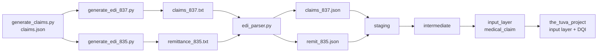

# edi-tuva-connector

A dbt connector that transforms raw X12 **837P** (professional claims) and **835**
(remittance) EDI into the [Tuva Project](https://thetuvaproject.com) input layer,
landing a `medical_claim` model that conforms column-for-column to Tuva's live
148-column contract and passes Tuva's built-in data-quality tests.

Raw EDI in, a faithful parser turns it into JSON, dbt types it, joins it, applies
claims logic, and lands it as a contract-conforming model, validated by both
Tuva's DQI suite and the project's own invariants.

> Data is fully synthetic and contains no PHI. Claims are billed under a fictional
> provider, Riverbend Medical Group.

---

## Pipeline



1. **Generate** synthetic claims from one canonical `claims.json`, then emit
   matching 837P and 835 EDI from that same source.
2. **Parse** the raw EDI into source-faithful JSON at native grain.
3. **Stage** the JSON into typed relations (typed select only).
4. **Intermediate** does the cross-source claims logic.
5. **Input layer** maps to Tuva's `medical_claim` contract.

---

## Repository layout

```
edi-tuva-connector/
├── generate_claims.py            # canonical claims.json (single source of truth)
├── generate_edi_837.py           # claims.json -> raw 837P
├── generate_edi_835.py           # claims.json -> raw 835
├── edi_parser.py                 # raw EDI -> claims_837.json + remit_835.json
├── verify_parse.py               # QA: field completeness and join health (dev tool)
├── sample_data/
│   ├── claims.json
│   ├── claims_837.txt
│   ├── remittance_835.txt
│   └── parsed/                   # parser output read by dbt
│       ├── claims_837.json
│       └── remit_835.json
├── models/
│   ├── staging/                  # typed select only, one source per natural grain
│   │   ├── sources.yml           # parsed JSON declared as external sources
│   │   ├── stg_837_claim.sql
│   │   ├── stg_837_claim_line.sql
│   │   ├── stg_837_diagnosis.sql
│   │   ├── stg_835_claim.sql
│   │   ├── stg_835_claim_line.sql
│   │   ├── stg_835_line_adjustment.sql
│   │   └── stg_835_claim_adjustment.sql
│   ├── intermediate/             # cross-source joins and claims logic
│   │   ├── int_837_diagnosis_pivot.sql
│   │   ├── int_835_line_financials.sql
│   │   └── int_medical_claim.sql
│   └── input_layer/
│       ├── medical_claim.sql     # thin select to Tuva's 148-column contract
│       ├── medical_claim.yml     # not_null and accepted_values tests
│       ├── eligibility.sql       # zero-row stub (lets the package compile)
│       └── pharmacy_claim.sql    # zero-row stub
├── tests/
│   ├── assert_837_claim_charge_balances.sql
│   ├── assert_835_claim_paid_balances.sql
│   ├── assert_positional_alignment.sql
│   ├── assert_medical_claim_grain.sql
│   ├── assert_medical_claim_amounts_sane.sql
│   └── fixtures/make_fixtures.py # conformant 837P/835 fixture for parser testing
├── dbt_project.yml
└── packages.yml                  # the_tuva_project 0.18.x
```

---

## The three layers

**Staging** flattens each source's own nested arrays into typed relations at their
natural grain, with no cross-source joins and no logic. Numeric casts use
`try_cast`, so an empty value becomes null rather than failing the run, and
not_null tests do the real validation.

**Intermediate** owns everything cross-source: the positional join of 837 to 835
on `claim_id` plus `line_sequence`, header dates from the min and max of line
service dates, `person_id` mapped from `member_id`, the diagnosis pivot to wide
`diagnosis_code_1..25`, the patient-responsibility split into deductible,
coinsurance, and copayment from CARC codes, `allowed_amount` as paid plus those
three buckets, and denial and reversal handling.

**Input layer** reshapes the intermediate into Tuva's full 148-column
`medical_claim` contract in exact order, populated where the data exists and
explicit typed nulls for the institutional and clinical fields a professional
claim does not carry.

---

## Design decisions

- **Source-faithful parser.** The parser does zero type coercion (every value is
  the raw string, money included) and reads its delimiters from the ISA segment
  rather than hardcoding them. Typing and logic live in dbt. This keeps parser
  bugs and logic bugs separable.
- **Two outputs, not one pre-joined row.** The parser emits the 837 and 835 at
  native grain so dbt owns the join, the grain, and the logic.
- **Positional line join.** The source writes no per-line `REF*6R` line control
  number, so 837 and 835 lines are aligned by position within the claim
  (`line_sequence`). A test (`assert_positional_alignment`) guards that the
  procedure codes match at every aligned position.
- **Contract matched from the repo, not memory.** The 148-column list and order
  were pulled directly from the Tuva repo, because the contract changes between
  versions.
- **Adjudication rules.** Reversals (835 status 22) are dropped so only final
  adjudicated activity lands; denials (status 4) are kept with their paid amount.
  `person_id` is mapped 1:1 from `member_id` until a master patient index exists.
  `allowed_amount` follows Tuva's definition: paid plus deductible, coinsurance,
  and copayment.

---

## Quickstart

Requires Python 3.11 and `dbt-duckdb` 1.10.x.

```bash
# 1. install the dbt package and its dependencies
dbt deps

# 2. (optional) regenerate synthetic EDI; sample_data is already committed
python generate_claims.py
python generate_edi_837.py
python generate_edi_835.py

# 3. parse raw EDI into JSON (reads sample_data, writes sample_data/parsed)
python edi_parser.py

# 4. build the connector
dbt run --select +medical_claim
```

---

## Testing

Two suites run against the connector.

**The project's own tests** (5 singular plus schema-level not_null and
accepted_values):

- `assert_837_claim_charge_balances` — 837 header charge equals the sum of line charges
- `assert_835_claim_paid_balances` — 835 claim paid equals the sum of line paid
- `assert_positional_alignment` — 837 and 835 procedures match at every aligned line
- `assert_medical_claim_grain` — primary key uniqueness (`claim_id`, `claim_line_number`, `data_source`)
- `assert_medical_claim_amounts_sane` — allowed not below paid, paid not above charge, no negatives

**The Tuva package input-layer DQI suite** runs against `medical_claim`. It needs
the package seeds loaded first, and the relationship tests reference two
terminology models:

```bash
dbt seed
dbt run  --select terminology__present_on_admission terminology__discharge_disposition
dbt test --select input_layer__medical_claim --exclude check_medical_claim_eligibility_overlap
```

The `--exclude` drops a cross-table enrollment-overlap check that does not apply
to a claims-only connector with a stubbed eligibility model.

**Current result:** 296 Tuva DQI tests pass, the project's own tests pass, and the
only warnings are `warn_if_null_percentage_is_100` on columns intentionally left
null for a professional 837P source (plan, paid_date, facility_npi, the TINs,
in_network_flag, file_name).

---

## Scope and assumptions

- 837P professional only; place of service 11; subscriber equals patient.
- No per-line `REF*6R`, so line alignment is positional.
- Source carries no `LQ` remark codes and no claim-level adjustments in the
  synthetic data; both are modeled for real remittances.
- Institutional, ICD-procedure, and present-on-admission fields are null by
  design for a professional source.

---

## Tech stack

Python (standard library parser), dbt, dbt-duckdb, DuckDB, the_tuva_project 0.18.

## Roadmap

- Migrate the warehouse from DuckDB to Snowflake (JSON read to stage plus VARIANT,
  `unnest` to `LATERAL FLATTEN`, `try_strptime` to `TRY_TO_DATE`, 0-based array
  indexing).
- Capture `paid_date` (835 BPR production date) and `file_name` to reduce the
  null-percentage warnings.
